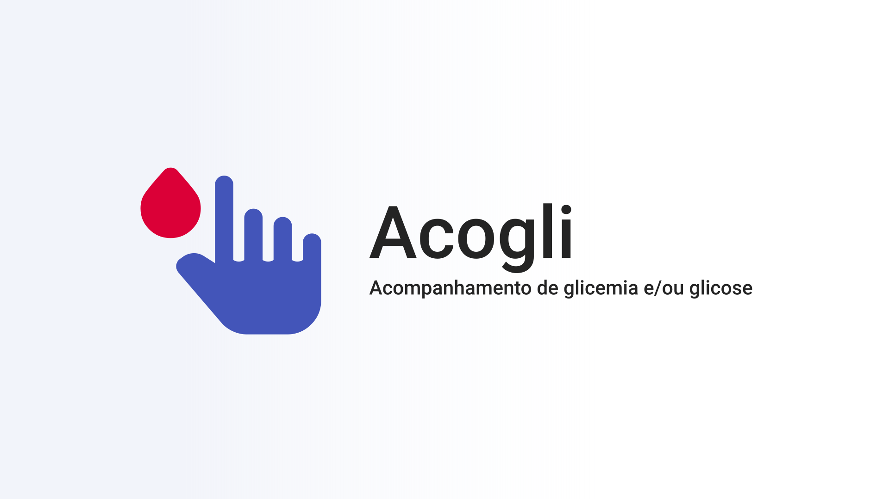

# 
 Termo de privacidade 

## Como os dados são coletados
O aplicativo Acogli não compartilha os dados coletados, nem os envia para serem armazenados em um servidor. Sendo assim, os dados estão salvos apenas em seu dispositivo em local seguro e nem mesmo os desenvolvedores conseguem acessá-los. Vale ressaltar que o acesso a internet do próprio aplicativo é bloqueado por padrão para sua segurança e privacidade.

## Como os dados são utilizados
O Acogli não realiza nenhum processamento sobre seus dados. Eles são apresentados na tela de listagem de aferições apenas para quem tem acesso ao seu dispositivo.

## Como os dados podem ser apagados
Pode-se apagar todos os dados do Acogli nas configurações do dispositivo sem necessidade de desinstalá-lo. Vale ressaltar que o processo pode ser diferente para cada fabricante/aparelho, mas sempre há essa opção. Caso não a encontre, basta desinstalar o Acogli e todos os dados serão removidos sem a necessidade de entrar em contato com os desenvolvedores.

## Como os dados podem ser compartilhados
Caso o usuário necessite compartilhar os dados podem ser realizados prints da tela. O compartilhamento de tais prints é de inteira responsabilidade do usuário.

  

_"Auxiliando no cuidado da sua saúde com segurança e privacidade_  
Equipe Acogli